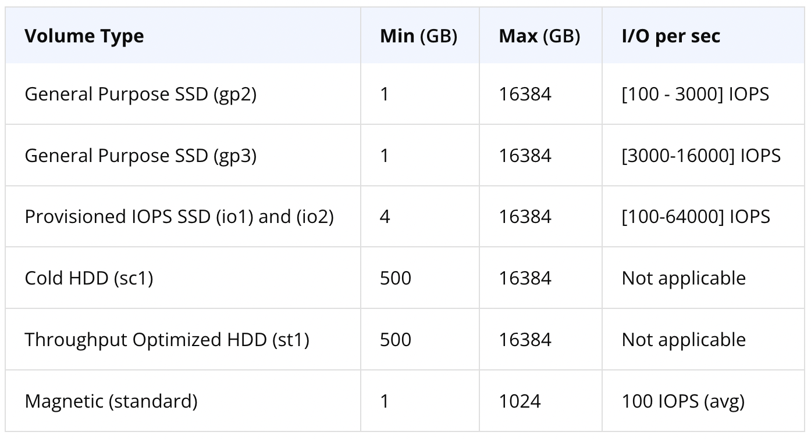

# Launch EC2 Instance with Terraform

```bash
terraform init
teraform validate
terraform plan
terraform apply -auto-approve
terraform destroy -auto-approve
```

## Login with SSH key

```bash
ssh -i ~/.ssh/id_ed25519 ec2-user@3.90.229.251
```

## Describe all EBS volumes

```bash
aws ec2 describe-volumes --profile cloud-developer
```

## Mount EBS volume

To mount an EBS volume attached to an EC2 instance, follow these steps:

---

### **1. Verify the Volume Attachment**

1. **Check Attached Volumes**:
   SSH into your EC2 instance and run:

   ```bash
   lsblk
   ```

   This will list all block devices, including the root volume and the attached EBS volume. Look for the device name `/dev/sdh` (or its equivalent, such as `/dev/xvdh`).

   Example output:

   ```
   NAME    MAJ:MIN RM  SIZE RO TYPE MOUNTPOINT
   xvda    202:0    0   8G  0 disk /
   xvdh    202:80   0  20G  0 disk
   ```

2. **Confirm Volume Attachment in AWS**:
   Run the following AWS CLI command to verify the volume is attached:
   ```bash
   aws ec2 describe-volumes --volume-ids <volume-id>
   ```

---

### **2. Prepare the Volume**

If the EBS volume is new, it needs to be formatted before mounting.

#### **Check for an Existing Filesystem**

Run:

```bash
sudo file -s /dev/xvdh
```

- If the output is `data`, the volume is unformatted.
- If the output shows a filesystem (e.g., `ext4` or `xfs`), skip to **Step 3**.

#### **Format the Volume** (if needed)

To format the volume as `ext4`:

```bash
sudo mkfs.ext4 /dev/xvdh
```

---

### **3. Create a Mount Point**

Create a directory where the volume will be mounted:

```bash
sudo mkdir /mnt/my-ebs-volume
```

---

### **4. Mount the Volume**

Mount the volume to the directory:

```bash
sudo mount /dev/xvdh /mnt/my-ebs-volume
```

#### **Verify the Mount**

Run:

```bash
df -h
```

You should see the volume listed and mounted at `/mnt/my-ebs-volume`.

---

### **5. Make the Mount Persistent**

To ensure the volume is mounted automatically after a reboot:

1. Get the UUID of the volume:

   ```bash
   sudo blkid /dev/xvdh
   ```

   Example output:

   ```
   /dev/xvdh: UUID="1234-5678-90AB-CDEF" TYPE="ext4"
   ```

2. Edit the `/etc/fstab` file:

   ```bash
   sudo nano /etc/fstab
   ```

3. Add an entry for the volume:

   ```
   UUID=1234-5678-90AB-CDEF /mnt/my-ebs-volume ext4 defaults,nofail 0 2
   ```

4. Test the configuration:
   ```bash
   sudo mount -a
   ```

---

### **6. Optional: Adjust Permissions**

If you need non-root users to access the volume:

```bash
sudo chown -R ec2-user:ec2-user /mnt/my-ebs-volume
```

Replace `ec2-user` with your username.

---

### **Troubleshooting**

1. **Volume Not Detected**:

   - Ensure the volume is attached to the correct instance.
   - Reboot the instance if necessary.

2. **Mount Fails After Reboot**:
   - Check `/etc/fstab` for syntax errors.
   - Use `nofail` in the `/etc/fstab` entry to prevent boot issues.

## How to create EBS volume with AWS CLI

## EBS Volume Type



# Launch EC2 instance with AWS CLI

- **Step 1: Create Key-Pair**

```bash
aws ec2 create-key-pair --key-name MyKeyPair --query 'KeyMaterial' --output text > MyKeyPair.pem
```

- **Step 2: Create a Security Group**

```bash
aws ec2 create-security-group --group-name MySecurityGroup --description "My security group description"
```

- **Step 3: EC2 instance**

```bash
aws ec2 run-instances --image-id ami-xxxxxxxx --count 1 --instance-type t2.micro --key-name MyKeyPair
```

- **Step 4: Create EBS volume**

```bash
aws ec2 create-volume \
--availability-zone us-east-1a \
--size 10 \
--tag-specifications 'ResourceType=volume,Tags=[{Key=Environment,Value=Production},{Key=Owner,Value=JohnDoe}]'
```

- \*\*Step 5: Attach EBS volume to EC2

```bash
aws ec2 attache-volume \
--device /dev/sdh
--instance-id <value>
--volume-id <value>
```

Attention

Replace ami-12345678 with the appropriate AMI ID for your region and requirements.
If you are using a specific VPC or subnet, you may need to include additional flags, such as --subnet-id or --security-group-ids.
Ensure that the MyKeyPair.pem file has proper permissions before use:

```bash
chmod 400 MyKeyPair.pem
```

Recommended Read
